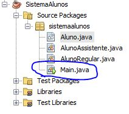
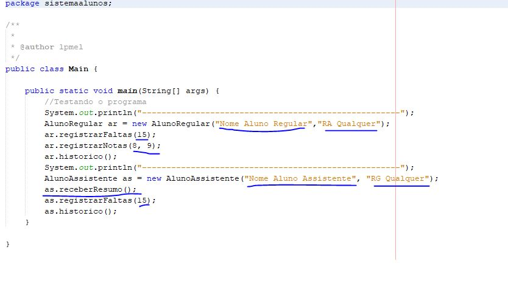

# Projeto SistemaAlunos
Projeto de um sistema cadastro básico desenvolvido durante as aulas de Programação Orientada a Objeto utilizando Java.

## Como utilizar
- A aplicação é bem básica, funcionando por meio do console do NetBeans. Com o projeto salvo em sua máquina e aberto no NetBeans, procure o arquivo **Main.java**:

    

- Agora dentro do **Main.java** substitua os dados sublinhados e teste os métodos criados: 
    - Para **Alunos Regulares**: registrarFaltas(Registra quantidade de faltas), registrarNotas(Registra as duas notas do aluno), historico(Exibe um print com todos os dados do aluno)
    - Para **Alunos Auxiliares**: receberResumo(Recebe o resumo necessário para a Aprovação do aluno), registrarFaltas(Registra a quantidade de faltas), historico(Exibe um print com todos os dados do aluno)

    

## Funcionalidades
* [x] Cadastro de alunos utilizando herança; 

* [x] Gerenciamento dos dados dos alunos cadastrados; 

* [x] Todos os métodos funcionais;
